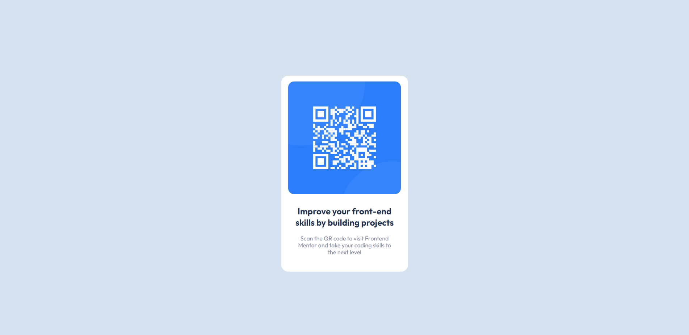

# Frontend Mentor - QR code component solution

This is a solution to the [QR code component challenge on Frontend Mentor](https://www.frontendmentor.io/challenges/qr-code-component-iux_sIO_H). Frontend Mentor challenges help you improve your coding skills by building realistic projects.

## Overview

### The challenge

Users should be able to:

- View the optimal layout for the component depending on their device's screen size

### Screenshot

### Links

- Live Site URL: [https://nath3010.github.io/qr-code-component-main/](https://nath3010.github.io/qr-code-component-main/)

## Built with

- Semantic HTML5 markup
- CSS custom properties
- Flexbox
- CSS Grid
- Mobile-first workflow

## Author

- Linkedin - [Nathalia Dias de Souza](https://www.linkedin.com/in/nathalia-dias-de-souza-08964b130/)
- Frontend Mentor - [@nath3010](https://www.frontendmentor.io/profile/nath3010)
